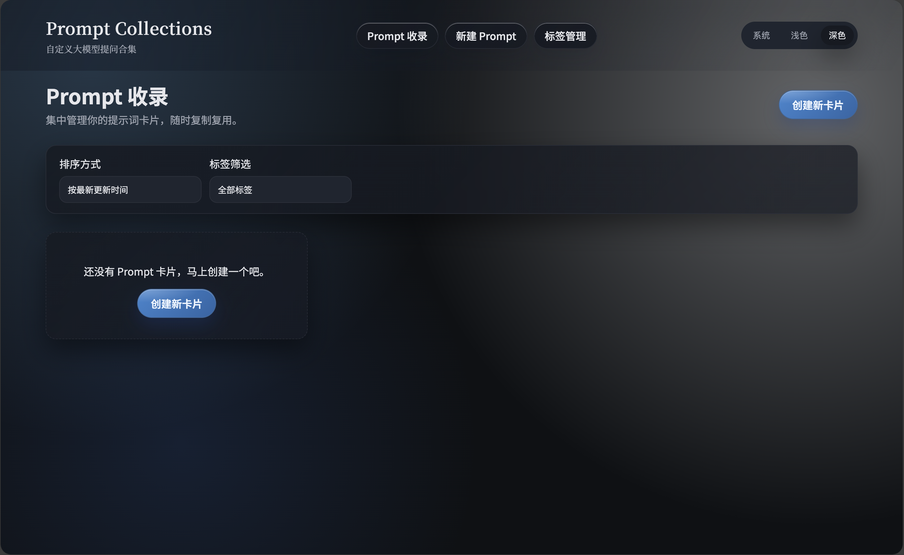
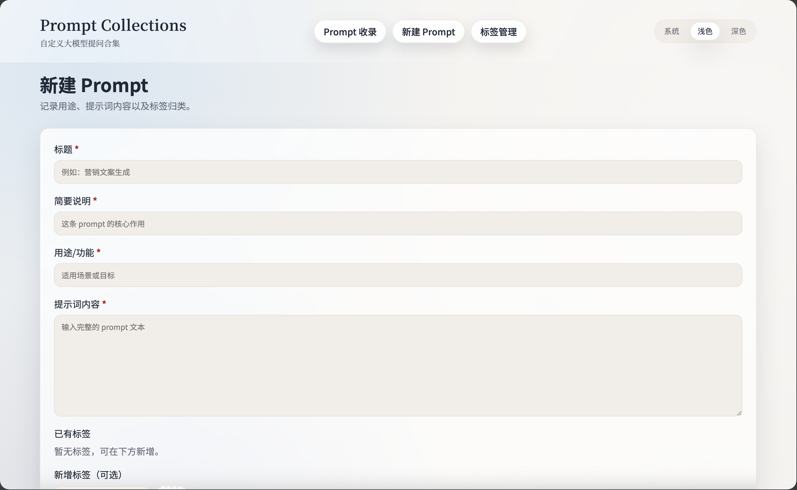

# Prompt-Collections

一个用于收录与管理大模型提问提示词的轻量系统，支持卡片化展示、标签管理与一键复制。

## 界面



## 功能
- Prompt 卡片创建、查看、删除
- 标签多选与颜色管理
- 详情页查看创建/更新时间与完整提示词内容
- 跟随系统主题或手动切换浅色/深色

## 技术栈
- FastAPI + Jinja2 Templates
- SQLite
- 纯前端静态样式

## 本地运行（Python 3.11）
```bash
python -m venv .venv
source .venv/bin/activate
pip install -r requirements.txt
uvicorn app.main:app --reload
```
访问 `http://localhost:8000`

## Docker 运行
```bash
docker build -t prompt-collection .
docker run -p 8000:8000 -v $(pwd)/data:/app/data prompt-collections
```

或使用 compose：
```bash
docker compose up --build
```

## 目录结构
```
app/
  main.py
  db.py
  templates/
  static/
data/
Dockerfile
requirements.txt
```